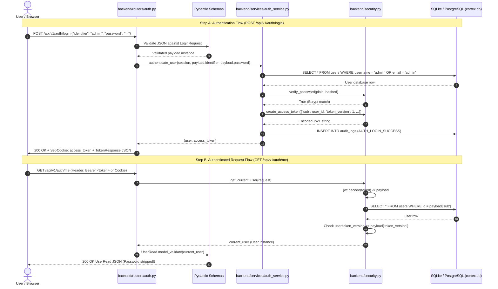

# Authentication & Authorization Sequence Flow

Preview this diagram in any Markdown viewer supporting Mermaid.

```mermaid
sequenceDiagram
    autonumber
    actor Client as User / Browser
    participant Router as backend/routers/auth.py
    participant Schema as Pydantic Schemas
    participant Service as backend/services/auth_service.py
    participant Sec as backend/security.py
    participant DB as SQLite / PostgreSQL (cortex.db)

    Note over Client, DB: Step A: Authentication Flow (POST /api/v1/auth/login)
    Client->>Router: POST /api/v1/auth/login {"identifier": "admin", "password": "..."}
    Router->>Schema: Validate JSON against LoginRequest
    Schema-->>Router: Validated payload instance
    Router->>Service: authenticate_user(session, payload.identifier, payload.password)
    Service->>DB: SELECT * FROM users WHERE username = 'admin' OR email = 'admin'
    DB-->>Service: User database row
    Service->>Sec: verify_password(plain, hashed)
    Sec-->>Service: True (Bcrypt match)
    Service->>Sec: create_access_token({"sub": user_id, "token_version": 1, ...})
    Sec-->>Service: Encoded JWT string
    Service->>DB: INSERT INTO audit_logs (AUTH_LOGIN_SUCCESS)
    Service-->>Router: (user, access_token)
    Router->>Client: 200 OK + Set-Cookie: access_token + TokenResponse JSON

    Note over Client, DB: Step B: Authenticated Request Flow (GET /api/v1/auth/me)
    Client->>Router: GET /api/v1/auth/me (Header: Bearer <token> or Cookie)
    Router->>Sec: get_current_user(request)
    Sec->>Sec: jwt.decode(token) -> payload
    Sec->>DB: SELECT * FROM users WHERE id = payload['sub']
    DB-->>Sec: user row
    Sec->>Sec: Check user.token_version == payload['token_version']
    Sec-->>Router: current_user (User instance)
    Router->>Schema: UserRead.model_validate(current_user)
    Schema-->>Client: 200 OK UserRead JSON (Password stripped!)
```
