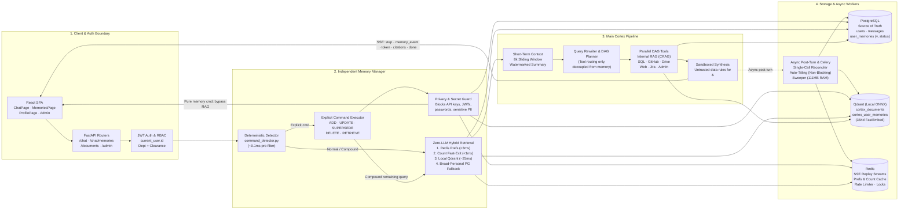

# Cortex System & Memory Architecture Flow (Rectangular Layout)

```mermaid
flowchart LR
    %% ===== COLUMN 1: ENTRY & AUTH =====
    subgraph C1["1. Client & Auth Boundary"]
        direction TB
        UI["React SPA\nChatPage · MemoriesPage\nProfilePage · Admin"]
        API["FastAPI Routers\n/chat · /chat/memories\n/documents · /admin"]
        AUTH["JWT Auth & RBAC\ncurrent_user.id\nDept + Clearance"]
        UI --> API --> AUTH
    end

    %% ===== COLUMN 2: MEMORY MANAGEMENT SYSTEM =====
    subgraph C2["2. Independent Memory Manager"]
        direction TB
        DET["Deterministic Detector\ncommand_detector.py\n(~0.1ms pre-filter)"]
        CMD["Explicit Command Executor\nADD · UPDATE · SUPERSEDE\nDELETE · RETRIEVE"]
        GUARD["Privacy & Secret Guard\nBlocks API keys, JWTs,\npasswords, sensitive PII"]
        RET["Zero-LLM Hybrid Retrieval\n1. Redis Prefs (<3ms)\n2. Count Fast-Exit (<1ms)\n3. Local Qdrant (~25ms)\n4. Broad-Personal PG Fallback"]
        DET -->|Explicit cmd| CMD --> GUARD
        DET -->|Normal / Compound| RET
    end

    %% ===== COLUMN 3: MAIN CHAT & DAG PIPELINE =====
    subgraph C3["3. Main Cortex Pipeline"]
        direction TB
        CTX["Short-Term Context\n8k Sliding Window\nWatermarked Summary"]
        PLAN["Query Rewriter & DAG Planner\n(Tool routing only,\ndecoupled from memory)"]
        TOOLS["Parallel DAG Tools\nInternal RAG (CRAG)\nSQL · GitHub · Drive\nWeb · Jira · Admin"]
        SYN["Sandboxed Synthesis\nUntrusted-data rules for\n<retrieved_context> &\n<user_preferences_and_context>"]
        CTX --> PLAN --> TOOLS --> SYN
    end

    %% ===== COLUMN 4: STORAGE, CACHE & WORKERS =====
    subgraph C4["4. Storage & Async Workers"]
        direction TB
        PG[("PostgreSQL\nSource of Truth\nusers · messages\nuser_memories (v, status)")]
        QD[("Qdrant (Local ONNX)\ncortex_documents\ncortex_user_memories\n(384d FastEmbed)")]
        RD[("Redis\nSSE Replay Streams\nPrefs & Count Cache\nRate Limiter · Locks")]
        BG["Async Post-Turn & Celery\nSingle-Call Reconciler\nAuto-Titling (Non-Blocking)\nSweeper (111MB RAM)"]
        BG --> PG
        BG --> QD
        BG --> RD
    end

    %% ===== CROSS-COLUMN FLOWS =====
    AUTH --> DET
    GUARD -->|Pure memory cmd: bypass RAG| UI
    CMD -->|Compound remaining query| RET
    RET --> CTX
    SYN -->|SSE: step · memory_event · token · citations · done| UI
    SYN -.->|Async post-turn| BG
    GUARD --> PG
    GUARD --> QD
    GUARD --> RD
    RET --> RD
    RET --> QD
    RET --> PG
    TOOLS --> QD
    TOOLS --> PG
```
